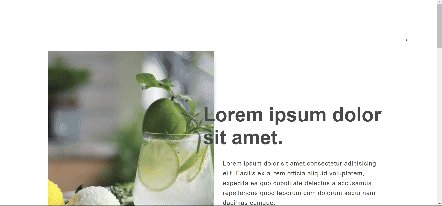
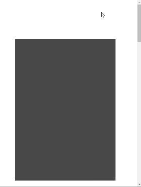

## 捲軸滾動有進場動畫的圖文切版

#### 課程臨摹練習筆記
> refer to Xuemi

#### 訓練重點: 
 - HTML及CSS切版 
 - bootstrap-grid.css排版及RWD 
 - rellax.js 滾動視差效果 
 - wow.js 動畫插件
-  CSS animation動畫(@keyframes) 

## Demo預覽

## 建議的開啟方式
download > VScode > index.html > open with live server
