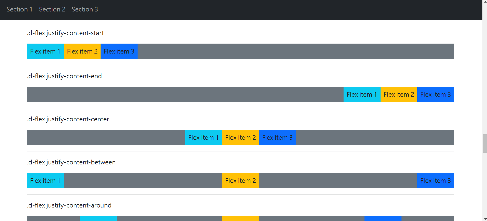

## Bootstrap示範

#### 課程臨摹及docs自學筆記
> refer to Bootstrap
> refer to W3school
> refer to Youtube

#### 訓練重點
  - 了解Bootstrap各項class效果
  - HTML及CSS切版
  - 建置一個開發時可以參考的工具箱(資料庫)

## Demo

## 建議的開啟方式
#### 1example 單頁切版示範 
- download > VScode > index.html > open with live server
#### 2guidelines 各項class效果演示
- download > VScode > bootstrap-guidelines1.html
- download > VScode > bootstrap-guidelines2.html