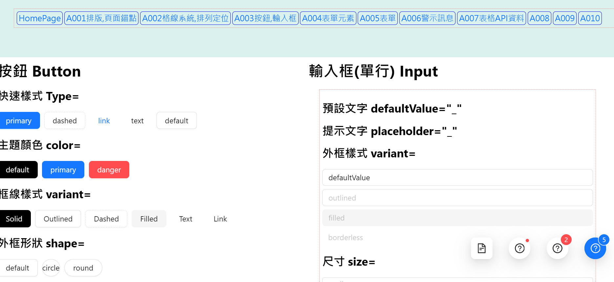
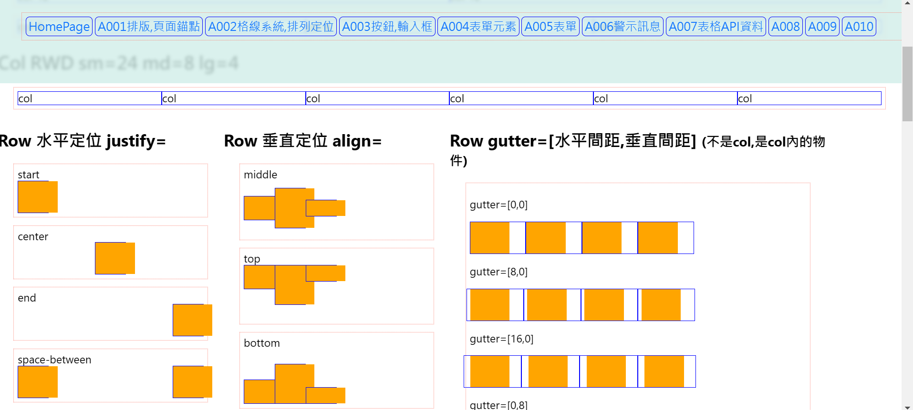

## React AntDesign示範

#### 課程臨摹練習筆記
> refer to AntDesign
> refer to CodeWithAamir youtube

#### 用途及技術應用
 - React-router-dom
 - 了解AntDesign的各項用法
 - 建置一個開發時可以參考的工具箱(資料庫)

## Demo預覽

## 建議的開啟方式
- download > VScode > Terminal > New Terminal
- npm install
- npm start