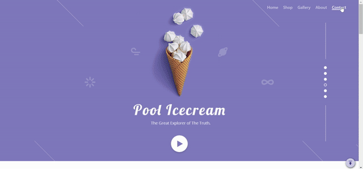

## 網站-臨摹冰店切版及動畫插件

#### 課程臨摹練習筆記
> refer to Xuemi

#### 技術應用
 - HTML及SCSS切版
 - 使用GoogleFont字型及Boxicon
 - toTop 固定懸浮按鈕
 - scrollreveal 捲軸滾動的文字進場
 - parellax 視差滾動的圖片物件
 - Photoshop後製修圖去背

## Demo預覽
[Demo網址](https://balmuda-demo-884.pages.dev/)  

## 建議的開啟方式
download > VScode > index.html > open with live server